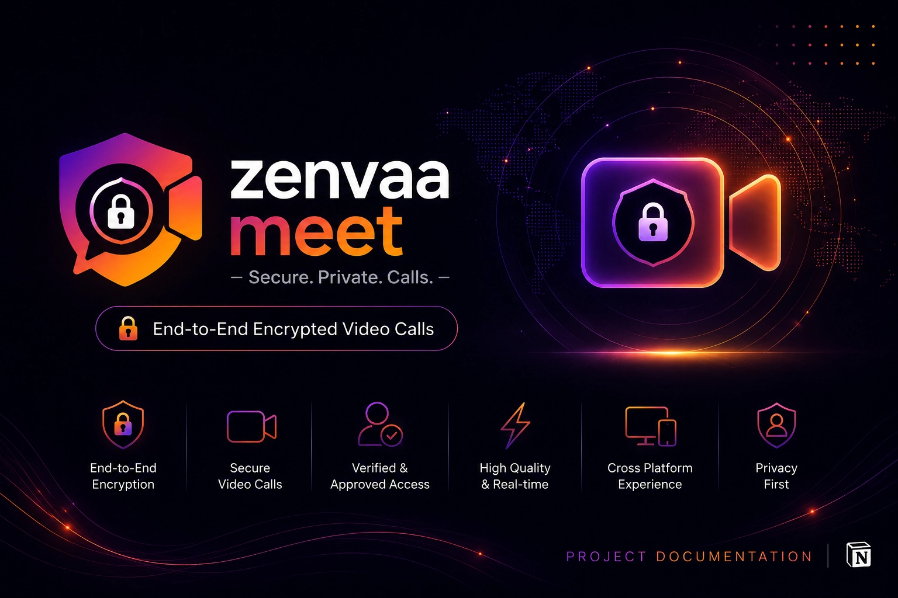

# Zenvaa Meet 🔐🎥

Zenvaa Meet is a modern, end-to-end encrypted (E2EE) video calling web app, built as a personal learning and portfolio project. It explores secure real-time communication design, peer-to-peer media transport, and scalable serverless architecture.

Two users connect and video call each other using nothing but a shared **call code** — video and audio flow directly between the two devices, and no server ever has access to the media stream.

> 📄 **A detailed case study covering the design decisions, encryption flow, and architecture reasoning behind this project is available on Notion:** [https://agrawalyash.notion.site/Zenvaa-Meet-Case-Study-3a75c8bb362a809aa28ee1ea55fb54e4]

---

## Table of Contents

- [About](#about)
- [Key Features](#key-features)
- [Tech Stack](#tech-stack)
- [System Architecture](#system-architecture)
- [Call Flow (Signaling + E2EE)](#call-flow-signaling--e2ee)
- [Project Scope](#project-scope)

---

## About

Zenvaa Meet enables two users to start a private video call using a simple, shareable call code — no permanent contacts, rooms, or public directories involved. Access is gated through Clerk authentication, so only signed-in users can generate or join a call. This is intentional, since the app is meant to be demonstrated to recruiters, friends, family, and selected testers rather than being publicly available.

### Project Objectives

- Build a secure, end-to-end encrypted peer-to-peer video calling application.
- Learn WebRTC fundamentals — SDP negotiation, ICE candidates, and NAT traversal.
- Explore serverless, reactive backend design using Convex for signaling.
- Practice call-code based session matching instead of persistent contact lists.
- Understand the role of TURN/STUN servers in real-world P2P connectivity.
- Demonstrate secure, production-inspired software engineering practices.

---

## Key Features

- End-to-end encrypted one-to-one video calling (media never touches a server)
- Call-code based session creation and joining — no accounts to add, no rooms to manage
- Authentication and access control via Clerk
- Real-time signaling (SDP offer/answer + ICE candidate exchange) via Convex
- Automatic call/session cleanup after a call ends
- Modern, responsive user interface

---

## Tech Stack

| Layer | Technology |
|---|---|
| Frontend | React.js + TypeScript |
| Backend | Convex (serverless, reactive functions — no traditional server) |
| Authentication | Clerk |
| Realtime Signaling | Convex reactive queries/mutations |
| Media Transport | WebRTC (peer-to-peer) |
| Encryption | WebRTC native encryption (DTLS-SRTP) |

---

## System Architecture

- **Call setup** (e.g. creating or joining a call code) flows through `React.js → Convex`, where Convex authenticates the request via Clerk before creating or matching a call session.
- **Signaling** (SDP offers/answers, ICE candidates) is exchanged entirely through Convex's reactive subscriptions — each peer subscribes to the call document and picks up the other side's data the moment it's written, with no manual WebSocket handling required.
- **Media** flows directly `Peer ↔ Peer` once the WebRTC handshake completes — Convex and the frontend are only involved in getting the two peers introduced, never in the actual call.
- **Clerk** issues and manages each user's session; Convex functions verify identity before allowing a call to be created or joined.
- If direct peer-to-peer connection isn't possible (strict NATs/firewalls), a TURN server relays the encrypted media — the relay never decrypts it, so end-to-end encryption still holds.

---

## Call Flow (Signaling + E2EE)

1. **Call creation** — User A creates a call and receives a unique call code, stored in Convex along with A's SDP offer.
2. **Joining** — User B enters the call code; Convex matches it to the existing call session.
3. **Signaling exchange** — A and B exchange SDP offer/answer and ICE candidates through Convex's reactive queries — updates propagate instantly without polling.
4. **WebRTC handshake** — Once both sides have the necessary connection info, a direct peer-to-peer connection is established.
5. **Encrypted media transport** — Audio/video streams between the two peers using WebRTC's built-in DTLS-SRTP encryption — the server never sees the media.
6. **Fallback relay (if needed)** — If a direct P2P path can't be established, an encrypted stream is relayed via a TURN server, which cannot decrypt the content.
7. **Cleanup** — Once the call ends, the call session and any signaling data are cleared from Convex.

**Core guarantee:** the backend only ever handles call-code matching and signaling metadata — never the audio/video content itself.

---

## Project Scope

Zenvaa Meet is intended solely as an educational and portfolio project. It is not designed to operate as a public video calling platform or commercial communication service. The focus is on demonstrating secure P2P architecture, WebRTC signaling, serverless backend design, and full-stack development skills, while maintaining responsible security practices.